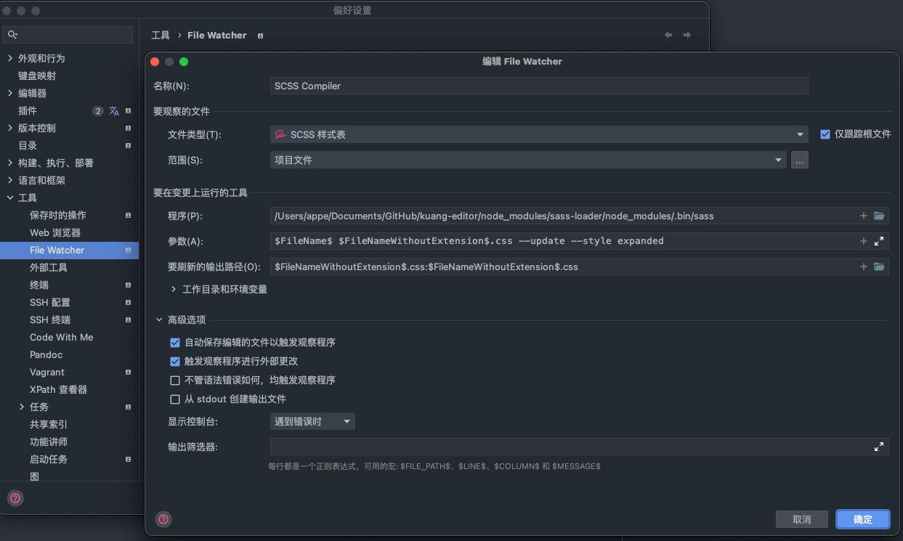

# 1.全局样式

```css
*{padding:0;margin:0;}
div,dl,dt,dd,form,h1,h2,h3,h4,h5,h6,img,ol,ul,li,table,th,td,p,span,a{border:0;}
img,input{border:none;vertical-align:middle;}
body{ font:12px Arial,"PingFang SC","Hiragino Sans GB","Microsoft YaHei","WenQuanYi Micro Hei",sans-serif;text-align:center;background:#FFF;color:#000;}
html{overflow-y:scroll;}
ul,ol{list-style-type:none;}
th,td,input{font-size:12px;}
h3{font-size:14px;}
button{border:none;cursor:pointer;font-size:12px;background-color:transparent;}
select{border-width:1px;_zoom:1;border-style:solid;padding-top:2px;font-size:12px;}
a:link,a:visited{text-decoration:none;color:#333;}
a:hover,a:active{text-decoration:underline;color:#f60;}
```


# 2.拟态按钮

谁用谁知道

box-shadow: *h-shadow v-shadow blur spread color* inset;

```scss
box-shadow: 2px 2px 4px #d1d9e6, -2px -2px 4px #fff;
    &:active {
    box-shadow: inset 2px 2px 4px #d1d9e6, inset -2px -2px 4px #fff;
	}
```

```css
button {
        user-select: none;
        margin: 4px;
        padding: 0;
        border: 0;
        display: block;
        outline: none;
        border-radius: calc(var(--button-height) / 2);
        font-size: 24px;
        font-family: Helvetica;
        font-weight: normal;
        color: rgb(125, 125, 125);
        background: linear-gradient(
            135deg,
            rgba(230, 230, 230, 0.7) 0%,
            rgba(246, 246, 246, 0.4) 100%
        );
        box-shadow: -4px -4px 10px -8px rgba(255, 255, 255, 1),
            4px 4px 10px -8px rgba(0, 0, 0, 0.5);

        &.active,
        &:active {
            box-shadow: -4px -4px 10px -8px rgba(255, 255, 255, 1) inset,
                4px 4px 10px -8px rgba(0, 0, 0, 0.5) inset;
        }
}
```


# 3.让文字不可被选中，不可被复制

```css
span {
  user-select: none;/*默认：user-select: text;*/
  -moz-user-select: none;
  -webkit-user-select: none;
  -ms-user-select: none;
}
```


# 4.头像框

```scss
#avatarBox {
    float: right;
    height: 40px;
    width: 40px;
    border-radius: 50%;
    box-shadow: 0 0 4px rgba(0, 0, 0, 0.6);
    margin-top: 10px;
    border: 1px solid #fff;
    overflow: hidden;
    transition: all 0.5s;
    // 头像
    img {
      height: 100%;
      width: 100%;
      object-fit: cover;
    }
    &:hover {
      transform: scale(1.1);
    }
  }
```

# 5.文字收折

#### 1.单行文本溢出

单行文本溢出一般没有代码上的兼容问题，
//需要对元素盒子设置一个宽度以兼容部分浏览器

```css
overflow: hidden; //超出部分隐藏
white-space: nowrap; //表示不换行
text-overflow: ellipsis; //加省略号
```


#### 2.多行文本溢出

适用于webkit浏览器（如chrome、QQ极速、搜狗等）和移动端。

```css
display: -webkit-box; //必须有，对象作为弹性伸缩盒子模型显示
overflow:hidden;
text-overflow: elipsis;
word-break: break-all;
-webkit-box-orient:vertical; //伸缩盒子子元素的排列方式
-webkit-line-clamp: 2 //数字表示是文本行数，如3，表示第三行会出现省略号，限制一个块内显示的文本行数
```

# 6.选择前几个 nth-child和nth-of-type

**注 数字必须是 -n + 6 这样的，而不能是 6 - n** 

```css
/* 选择第n个，n位数字  */
:nth-child(n)

选择列表中的偶数标签
:nth-child(2n)

选择列表中的奇数标签
:nth-child(2n-1)

选择前几个元素
/*【负方向范围】选择第1个到第6个 */
:nth-child(-n+6){}

从第几个开始选择
/*【正方向范围】选择从第6个开始的，直到最后  */
:nth-child(n+6){}

两者结合使用，可以限制选择某一个范围
/*【限制范围】选择第6个到第9个，取两者的交集【感谢小伙伴的纠正~】 */
:nth-child(-n+9):nth-child(n+6){}

选择列表中的倒数第n个标签 n为数字
:nth-last-child(n)
```


# 7.css变量

```css
:root{
    --global-color:blue;
}
background-color:var(--global-color);
```

# 8.gird布局

```scss
.parent{
  //grid布局
    display: grid;
    grid-template-areas:
        "result result result result"
        "ac plus-minus percent divide"
        "number-7 number-8 number-9 multiply"
        "number-4 number-5 number-6 subtract"
        "number-1 number-2 number-3 add"
        "number-0 number-0 dot equal";
    //grid布局，共4列 ，6行
    grid-template-columns: repeat(4, var(--button-width));
    grid-template-rows: repeat(6, var(--button-height));
}
//子元素 设置areas
grid-area: add
```

# 9.**精灵图的使用**


主要利用

```css
background-position:-0px,-0px;
```

从大图中圈小图

```css
width : 60px;
height: 60px;
background: url(../img/26letters.jpg) no-repeat -0px -0px;
/*background-position:-0px,-0px;*/
```

第一个是x轴，第二个是y轴，一般都是负值

配合并集选择器（选择器1,选择器2）


# 10.利用sass和less compile to css文件



webstorm上配置监听，或者用vscode的插件

npm需下载的插件：sass 和 sass-loader

或者全局下载 sass-loader

Mac的可能在环境变量/usr/local/bin （访达中用command+shift+g进入）

# 11.滚动条 scroll-bar

```css
/*定义滚动条高宽及背景 高宽分别对应横竖滚动条的尺寸*/
::-webkit-scrollbar
{
	width: 16px;
	height: 16px;
	background-color: #F5F5F5;
}

/*定义滚动条轨道 内阴影+圆角*/
::-webkit-scrollbar-track
{
	-webkit-box-shadow: inset 0 0 6px rgba(0,0,0,0.3);
	border-radius: 10px;
	background-color: #F5F5F5;
}

/*定义滑块 内阴影+圆角*/
::-webkit-scrollbar-thumb
{
	border-radius: 10px;
	-webkit-box-shadow: inset 0 0 6px rgba(0,0,0,.3);
	background-color: #555;
}
```

# 12.css打字机动画

```css
<style type="text/css">
        .typing {
            border-right: .1em solid;
            width: 9em;
            /*宽度为“字数 + em”*/
            white-space: nowrap;
            overflow: hidden;
            animation: typing 10s steps(9, end),
                /*步数为字数*/
                blink-caret 0.5s step-end infinite alternate;
        }

        @keyframes typing {
            from {
                width: 0;
            }
        }

        @keyframes blink-caret {
            50% {
                border-color: transparent;
            }
        }
    </style>

    <div class="typing">这是一个打字机动画</div>
```

# 13.让宽高相同

```css
.item{
  padding-top:50%;
  width:50%;
}
.item{
  width:50vw;
  height:50vw;
}
```

