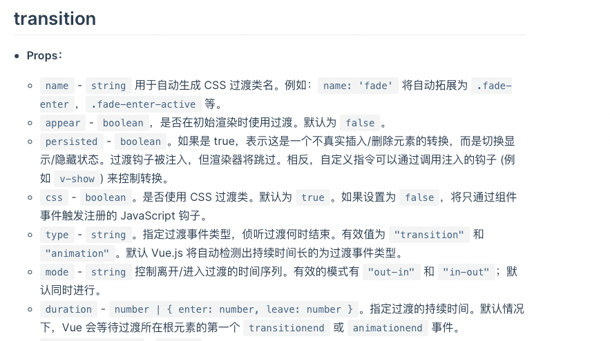

<my-component-name> 和 <MyComponentName>都可以用

使用 PascalCase (首字母大写命名) 定义组件名！！！！！！！

# 开发常用&易忘

## 1.vue cli起步+我常用的库

```powershell
vue ui
npm i
```

配置贼全面，傻瓜式操作了可以说是

我的配置是 vue2 + vuex + vuerouter + sass支持 

现在是 vue3 + ts + vuex + vue router +sass +elementUI

### animejs

文档：https://www.animejs.cn/documentation/#svgAttr

#### 引入 

```js
import anime from "animejs/lib/anime.es.js";
```

#### 调用

```javascript
anime({
  targets: '.linear-easing-demo .el', //css一样的选择器
  translateX: 250,                    //过渡效果  //同css
  scale: 1,                  					
  loop: true,                    	//	 循环
  direction: 'alternate',			//	 往返
  easing: 'linear'                	//动画曲线 
  keyframes: [						
    {translateY: -40},
    {translateX: 250},
    {translateY: 40},
    {translateX: 0},
    {translateY: 0}
  ],
});
```


## 2.router路由

#### （小路由）

```html
<component :is="组件名">
```


#### 基本用法

##### 1.html 超链接标签

```html
<!-- 字符串 -->
<router-link to="/" replace>Index</router-link>
<!-- :对象（注意冒号） -->
<router-link :to="{ path: '/home' }">Home</router-link>
<!-- 命名的路由 -->
<router-link :to="{ name: 'user', params: { userId: '123' }}">User</router-link>
```

##### 2.js编程式

`this.$router.replace(...)`与push唯一不同的是不会增加history

```javascript
// 字符串路径
this.$router.push('/users/eduardo')

// 带有路径的对象
this.$router.push({ path: '/users/eduardo' })

// 命名的路由，并加上参数，让路由建立 url
this.$router.push({ name: 'user', params: { username: 'eduardo' } })

// 带查询参数，结果是 /register?plan=private
this.$router.push({ path: '/register', query: { plan: 'private' } })

// 带 hash，结果是 /about#team
this.$router.push({ path: '/about', hash: '#team' })
```

```javascript
// 向前移动一条记录
this.$router.go(1);
this.$router.forward()

// 返回一条记录
this.$router.go(-1)
this.$router.back();

// 前进 3 条记录
this.$router.go(3)
```

### `onBeforeRouteLeave()`和`onBeforeRouteUpdate()`两个生命周期钩子


router/main.js

多级路由书写

```javascript
import Vue from "vue";
import VueRouter from "vue-router";
Vue.use(VueRouter);


// 修改路由
const routes = [
    {path:'/',
     name:'index',
     component:Home,
      //配置多级路由，在children数组里添加子路由信息
      children:[{
         path:'child1', 
         name:'child1',
         component: () => import("../views/layout/index.vue"),
        },
      ]
    },
    {path:'/about',component:About},
    {path:"*",redirect:'/'} //默认跳转
];
     
     
//配置路由     
const router = new VueRouter({
  mode: "history",
  base: process.env.BASE_URL,
  routes,
});
export default router;
```

## 3.vuex状态管理

#### 请求后端				actions 

#### 接入开发者工具	mutations  

#### 仓库						state

### vuex的API this.$store.dispatch('jia',2)   .commit('JIA',2)


## 4.组件插槽

#### 父组件 使用组件 模板`<my-catagory>`

```html
<my-catagory>
	<div slot="header"></div>				=>插入我定义的组件 提前 预留好的 插槽
    <template v-slot="center">		=>可以用这种template的写法,插入到插槽中
        <div>内容</div>
    </template>
    <div slot="footer"></div>
</my-catagory>
```

#### 子组件 组件定义 模板 `/myCatagory.vue`

```html
<template>
  <div>
    <h1>
      <slot name="title">我是默认值，如果父组件不给我传值，那就显示我</slot>
      <slot name="context">我是默认正文，父组件不传值给我，我就显示</slot>
      <slot>我是无名插槽默认值</slot>
    </h1>
  </div>
</template>
```

## 5.keep-alive

#### 概念

    keep-alive 是 Vue 的内置组件，当它包裹动态组件时，会缓存不活动的组件实例，而不是销毁它们。和 transition 相似，keep-alive 是一个抽象组件：它自身不会渲染成一个 DOM 元素，也不会出现在父组件链中。

#### 作用

    在组件切换过程中将状态保留在内存中，防止重复渲染DOM，减少加载时间及性能消耗，提高用户体验性

#### 原理

    在 created 函数调用时将需要缓存的 VNode 节点保存在 this.cache 中／在 render（页面渲染） 时，如果 VNode 的 name 符合缓存条件（可以用 include 以及 exclude 控制），则会从 this.cache 中取出之前缓存的 VNode 实例进行渲染。

    VNode：虚拟DOM，其实就是一个JS对象

#### Props

    include - 字符串或正则表达式。只有名称匹配的组件会被缓存。
    exclude - 字符串或正则表达式。任何名称匹配的组件都不会被缓存。
    max - 数字。最多可以缓存多少组件实例。

#### 生命周期函数

  1. ##### activated

      在 keep-alive 组件激活时调用
      该钩子函数在服务器端渲染期间不被调用

  2. ##### deactivated

      在 keep-alive 组件停用时调用
      该钩子在服务器端渲染期间不被调用

    被包含在 keep-alive 中创建的组件，会多出两个生命周期的钩子: activated 与 deactivated

    使用 keep-alive 会将数据保留在内存中，如果要在每次进入页面的时候获取最新的数据，需要在 activated 阶段获取数据，承担原来 created 钩子函数中获取数据的任务。

## 6.vue动画&过渡

```css
/** 
 *	1.动画 + .v-enter-active
 */
@keyframe comeIn {
    from {
        transform: translateX(200px);
    }
    to {
        transform: translateX(0);
    }
}
/*若无名字，默认为.v-enter-active*/
.v-enter-active {
    animation: comeIn 0.5s;
}
.v-leave-active {
    animation: comeIn 0.3s reverse;
}
/** 
 *	2. 过渡 from -> to 
 */
.v-enter-from,
.v-leave-to {
  opacity: 0;
}
.v-leave-from,
.v-enter-to {
  opacity: 1;
}
.v-enter-active,
.v-leave-active{
  transition: all 0.5s ease-out
}
```

```html
 <transition name="come">
    <p v-if="show">hello</p>
 </transition>
```

注：类名更改

```html
<transition
	enter-active-class="类名1"
  leave-active-class="类名2"
>
```



## 7.父子组件通信

子 调用 父组件方法

第一种方法是直接在子组件中通过this.$parent.event来调用父组件的方法

第二种方法是在子组件绑定事件，用$emit向父组件触发一个事件，父组件监听这个事件就行了。

第三种是父组件把方法以p rops 传入子组件中，在子组件里直接调用这个方法

```vue
Vue中子组件调用父组件的方法，这里有三种方法提供参考

第一种方法是直接在子组件中通过this.$parent.event来调用父组件的方法

父组件

<template>
  <div>
    <child></child>
  </div>
</template>
<script>
  import child from '~/components/dam/child';
  export default {
    components: {
      child
    },
    methods: {
      fatherMethod() {
        console.log('测试');
      }
    }
  };
</script>
子组件

<template>
  <div>
    <button @click="childMethod()">点击</button>
  </div>
</template>
<script>
  export default {
    methods: {
      childMethod() {
        this.$parent.fatherMethod();
      }
    }
  };
</script>
第二种方法是在子组件里用$emit向父组件触发一个事件，父组件监听这个事件就行了。

父组件
 

<template>
  <div>
    <child @fatherMethod="fatherMethod"></child>
  </div>
</template>
<script>
  import child from '~/components/dam/child';
  export default {
    components: {
      child
    },
    methods: {
      fatherMethod() {
        console.log('测试');
      }
    }
  };
</script>
子组件

<template>
  <div>
    <button @click="childMethod()">点击</button>
  </div>
</template>
<script>
  export default {
    methods: {
      childMethod() {
        this.$emit('fatherMethod');
      }
    }
  };
</script>
第三种是父组件把方法传入子组件中，在子组件里直接调用这个方法

父组件

<template>
  <div>
    <child :fatherMethod="fatherMethod"></child>
  </div>
</template>
<script>
  import child from '~/components/dam/child';
  export default {
    components: {
      child
    },
    methods: {
      fatherMethod() {
        console.log('测试');
      }
    }
  };
</script>
子组件
 

<template>
  <div>
    <button @click="childMethod()">点击</button>
  </div>
</template>
<script>
  export default {
    props: {
      fatherMethod: {
        type: Function,
        default: null
      }
    },
    methods: {
      childMethod() {
        if (this.fatherMethod) {
          this.fatherMethod();
        }
      }
    }
  };
</script>
```

# 原生js工具包

## 1.防抖

```javascript
//@/utils/util.js

/**
 * 无初始延时的 防抖函数
 * @func 需要进行防抖的函数
 * @delay 防抖的延迟时间
 */
export const debounce = (func, delay = 500) => {
  let timer;
  return function () {
    if (timer) clearTimeout(timer);  //如果已经有了，就再设置一个新的
    else func.apply(this, arguments);	//如果没有，则立即执行，并设置一个
    timer = setTimeout(() => {
      timer = null
    }, delay);
  }
}

/**
 * 有初始延时的防抖函数
 * @func 需要进行防抖的函数
 * @delay 防抖的延迟时间
 */
export const debounce = (func, delay = 500) => {
  let timer;
  return function () {//arguments 是这里的参数
    if (timer) {			//如果已经有定时器，就取消掉，再设置一个新的
      clearTimeout(timer);
    }						//没有，就设置一个
    timer = setTimeout(() => {
      timer = null;
      func.apply(this, arguments);
    }, delay);
  };
};
```

```javascript
@click="submit"
@click="goToRegisterOrLogin(-1)"

//组件.vue 中调用
import { debounce } from "@/utils/utils.js";

methods: {
    // 提交表单
    submit: debounce(function () {
      //函数内容//this为vuecomponent
    }, 500),
 	goToRegisterOrLogin: debounce(function (arg) {
        //函数内容
    },1000);   
}
```

