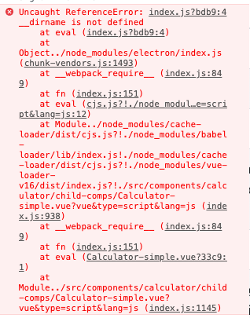

## electron进程之间通讯

1. 主进程向渲染进程通讯

- 主进程使用 `win.webContents.send` 发送消息
- 渲染进程使用 `ipcRenderer.on` 接收消息

2. 渲染进程向主进程通信

- - 渲染进程使用 `ipcRenderer.send` 或者 `ipcRenderer.invoke` 发送消息
  - 主进程使用 `ipcMain.on`或者`ipcMain.handle` 接收消息

# 环境搭建

## 1.原生环境

**坑: electron安装不完整，有损坏。----> 使用cnpm install electron**

```shell
npm init -y
cnpm install electron 或用一个全局兜一下底 cnpm install electron -g
之后手动添加 main.js index.html文件
在package.json中添加
"main": "background.js",
```

## 2.vue环境

**坑：vue-cli Ui 安装插件不完整，被墙，使用手动 **

```javascript
通过 vue-cli 新建项目后
cnpm electron
vue add electron-builder
```

**坑：electron-builder插件中有一个自动安装vue3谷歌浏览器插件的命令，然而没翻墙根本装不上，导致频繁网络请求和报错。注释掉即可**

```javascript
// import installExtension, {
//   VUEJS3_DEVTOOLS
// } from 'electron-devtools-installer'

app.on('ready', async () => {
  // if (isDevelopment && !process.env.IS_TEST) {
  //   // Install Vue Devtools
  //   try {
  //     await installExtension(VUEJS3_DEVTOOLS)
  //   } catch (e) {
  //     console.error('Vue Devtools failed to install:', e.toString())
  //   }
  // }
  createWindow()
})
```


# preload.js预加载

特殊性：不要直接调用electron的api！！electron的api和node有些许关系，所以并不是直接在渲染层起作用，也不是原生html中就可以调用的。

electron实现页面=>桌面端的功能扩展，主要通过**预加载**一个node的js文件完成。

通过它可以将api绑定到`window.electron`上，完成网页 -> 桌面端应用的完美跨越。

具体流程是

background.js <———ipcMain.on&ipcRender.send———> preload.js  <——window.Electron———> 渲染

```javascript
//preload.js
const { contextBridge, ipcRenderer } = require('electron')
const path = require('path')

contextBridge.exposeInMainWorld('electron', {
  startDrag: (fileName) => {
    ipcRenderer.send('ondragstart', path.join(process.cwd(), fileName))
  }
  myAPI:()=>{
  
	}
	/*your API here*/
})
```

```javascript
//background.js
import path from 'path'

function createWindow () {
		const mainWindow = new BrowserWindow({
      width: 800,
  	  height: 800,
    	webPreferences: {
      	preload: path.join(__dirname, 'preload.js'),
        nodeIntegration: true,//node限制 和 上下文限制不开启，preload会报错
      	contextIsolation: true
   		}
})
    /*
    坑1：__dirname，根目录，此时是指 /dist_electron
    坑2：preload路径必须是绝对路径
    */
```

```javascript
//vue.config.js
module.exports = {
  pluginOptions:{
    electronBuilder:{
      preload:'src/preload.js'
    }
  }
}
```





若在 渲染层 里调用 主进程 中的 api会触发以上报错


## preload.js打包设置

在使用`vue-cli-plugin-electron-builder`打包后发现应用程序没有执行preload.js文件于是查找原因


没有发现`preload.js`

**解决方案**

在`vue.config.js`中如下配置

```js
module.exports = {
  pluginOptions:{
    electronBuilder:{
      preload:'src/preload.js'
    }
  }
}
```

截取`background.js`的部分代码

```js
win = new BrowserWindow({
  webPreferences: {
    nodeIntegration: true,
    contextIsolation: false,
    webviewTag: true,
    preload: path.join(__dirname, 'preload.js') //注意，这里改变了路径
  },
  resizable: false,
  frame: false
});
```

打包后解压发现`preload.js`出现，搞定~运行也没问题


# 打包vue.config.js

```javascript
module.exports = {
    publicPath: '/',

    pages: {
        index: {
            // page 的入口
            entry: 'src/main.js',
            // 模板来源
            template: 'public/index.html',
            // 在 dist/index.html 的输出
            filename: 'index.html',
            // 当使用 title 选项时，
            // template 中的 title 标签需要是 <title><%= htmlWebpackPlugin.options.title %></title>
            title: '主页',
            // 在这个页面中包含的块，默认情况下会包含
            // 提取出来的通用 chunk 和 vendor chunk。
            chunks: ['chunk-vendors', 'chunk-common', 'index']
        },
        // subpage: 'src/subpage/main.js'
    },
  
    pluginOptions: {
        electronBuilder: {
            preload: 'src/electron/preload.js',
          
            builderOptions: {
                "appId": "com.fubaocalculator.app",
                "productName": "calculatorV1.0", //项目名，也是生成的安装文件名，即demo.exe
                "copyright": "Copyright © 2021", //版权信息
                "directories": {
                    "output": "./dist_electron" //输出文件路径
                },
                "asar": true,
                "dmg": {
                    "contents": [{
                            "x": 410,
                            "y": 150,
                            "type": "link",
                            "path": "/Applications"
                        },
                        {
                            "x": 130,
                            "y": 150,
                            "type": "file"
                        }
                    ]
                },
                "nsis": {
                    "oneClick": false, // 是否一键安装
                    "allowElevation": true, // 允许请求提升。 如果为false，则用户必须使用提升的权限重新启动安装程序。
                    "allowToChangeInstallationDirectory": true, // 允许修改安装目录
                    "installerIcon": './public/icons/icon.png', // 安装图标
                    "uninstallerIcon": './public/icons/icon.png', //卸载图标
                    "installerHeaderIcon": './public/icons/icon.png', // 安装时头部图标
                    "createDesktopShortcut": true, // 创建桌面图标
                    "createStartMenuShortcut": true, // 创建开始菜单图标
                    "shortcutName": "demo", // 图标名称
                },
                "win": { //win相关配置
                    "icon": './public/icons/icon.png', //路径相对于当前 vue.config.js，当前图标在根目录下，注意这里有两个坑
                    "target": [{
                        "target": "nsis", //利用nsis制作安装程序
                        "arch": [
                            "x64", //64位
                            "ia32" //32位
                        ]
                    }]
                },
                "mac": {
                    "icon": './public/icons/icon.png'
                }
            }
        },

    },

    lintOnSave: false
}
```

