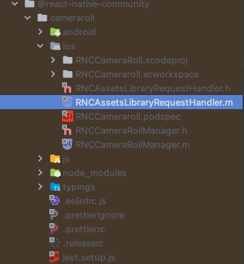
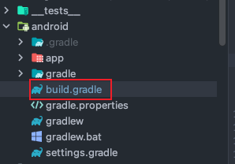
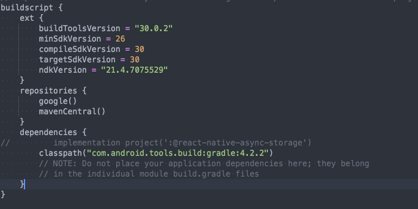

# 环境安装

我用的是mac-mini-m1版，ide用的是webstorm，全程挂梯子

首先需要安装Xcode，之后安 pod包管理工具

`brew install cocoapods`homebrew好像有些坑，如果需要link什么的就按homebrew上的提示来就行了，不过先安xcode貌似就没有bug了

之后新建项目

`npx react-native init AwesomeProject`

之后尝试一下运行

```shell
npm run ios
```


错误1:`error Failed to launch the app on simulator, An error was encountered processing the command (domain=com.apple.CoreSimulator.SimError, code=405):
Unable to lookup in current state: Shutdown`

不能打开模拟器，

解决方法：关闭模拟器，重新编译

错误2: 1 error: 

解决方法：https://github.com/aiba/react-native-m1配置m1环境

# 安装react navigation

错误1.

`Could not get BatchedBridge, make sure your bundle is packaged correctly`

解决：yarn或者npm install


错误：No bundle URL present.

Make sure you're running a packager server or have included a .jsbundle file in your application bundle.

解决：`cd ios 并且 pod install `或者重新启动一下


# 安装和使用iconfont图标

<a href="https://juejin.cn/post/6844903598883618829#heading-5">参考链接</a>

iOS需要将iconfont.ttf添加到工程里去，可以创建一个Fonts文件夹，将iconfont.ttf放入其中，再添加Fonts目录到工程中。在Info.plist中`Fonts provided by application`下添加一行iconfont.ttf。


安卓，Android放置在`app/src/main/assets/fonts`文件夹中，并且在`app/src/build.gradle`中添加配置:

```javascript
project.ext.vectoricons = [
    iconFontNames: [ 'iconfont.ttf' ]
]
```

```javascript
const icon = {
  fontFamily: 'iconfont',
  fontSize: 18,
  //fontWeight: 'bold',尽量不要调整宽度
  color: 'white',
};
```


使用：转义字符

```react
<Text style={icon}>&#xe67d;</Text>
<Text style={icon}>{'\u0e67d'}</Text>
```


如果用这种传参数，也可以用{props.icon}加载

# 几个快速掌握react navigation的demo

## 1.使用BottomTabNavigator底部导航栏

```react
import * as React from 'react';
import { Text, View } from 'react-native';
import { NavigationContainer } from '@react-navigation/native';
import { createBottomTabNavigator } from '@react-navigation/bottom-tabs';
import { MaterialCommunityIcons } from '@expo/vector-icons';

function Feed() {
  return (
    <View style={{ flex: 1, justifyContent: 'center', alignItems: 'center' }}>
      <Text>Feed!</Text>
    </View>
  );
}

function Profile() {
  return (
    <View style={{ flex: 1, justifyContent: 'center', alignItems: 'center' }}>
      <Text>Profile!</Text>
    </View>
  );
}

function Notifications() {
  return (
    <View style={{ flex: 1, justifyContent: 'center', alignItems: 'center' }}>
      <Text>Notifications!</Text>
    </View>
  );
}

const Tab = createBottomTabNavigator();

function MyTabs() {
  return (
    <Tab.Navigator
      initialRouteName="Feed"
      screenOptions={{
        tabBarActiveTintColor: '#e91e63',
      }}
    >
      <Tab.Screen
        name="Feed"
        component={Feed}
        options={{
          tabBarLabel: 'Home',
          tabBarIcon: ({ color, size }) =>{ return (
            <MaterialCommunityIcons name="home" color={color} size={size} />
          )}}        
      />
      ...
    </Tab.Navigator>
  );
}

export default function App() {
  return (
    <NavigationContainer>
      <MyTabs />
    </NavigationContainer>
  );
}
```

## 2.使用MaterialTopTabNavigator顶部导航栏

```react
import * as React from 'react';
import {createMaterialTopTabNavigator} from '@react-navigation/material-top-tabs';

const Tab = createMaterialTopTabNavigator();

export default function Activity() {
  return (
    <Tab.Navigator tabBarPosition="top" style={{marginTop: 0}}>
      <Tab.Screen name="Home" component={} />
      <Tab.Screen name="Profile" component={} />
    </Tab.Navigator>
  );
}
```

# 安装react antdesign mobile


错误：Could not get Batched bridge.

解决：8081端口被占用，全部重启即可

# 安装react-async-storage本地缓存

凌晨四点加这个包直接爆红，说这个RNcameraRoll编译不行


无论是`npm install @react-native-community/cameraroll  `还是

`yarn add @react-native-community/cameraroll     ` ，又或者`pod install`和`npx react-native link`均无法解决

索性直接上xcode去查报错，发现报错只有如下这个


于是又返回去查包



发现这个的名字并非是`RCT`而是`RNC`


改名后红色消失，直接可以正常编译了，这个包作者的拼写错误真的很让我无语


# 安卓环境搭建（不要信中文网）

根据rn中文网配好android studio环境后

调试rn安卓的时候，又出现了问题，

根据build.gradle，安装




错误：Failed to find Platform SDK with path:platforms; android-25

(cameraroll这个包也有点老了吧)

解决：遇到这个报错就下一个对应25版本的SDK即可，也就80多MB

------


错误： SDK location not found. Define location with an ANDROID_SDK_ROOT environment variable or by setting the sdk.dir path in your project's local properties file at '/Users/appe/Documents/GitHub/KuangMoreover/android/local.properties'.

解释：根据RN中文网建立的环境变量是 `ANDROID_HOME`，但其实我们需要的是`ANDROID_SDK_ROOT`


解决：command+shift+g打开finder，进入～，command+shift+ .（del）  ，显示隐藏文件，配置环境变量，将***全部的***`ANDROID_HOME`改为`ANDROID_SDK_ROOT`


错误：`cameraroll`报错，使用或覆盖了已过时的 API

解决：



更改了一下 sdk版本到30，建议这里的东西都不要改，我按rn中文网上的改版本，react-native-cameraroll频繁报错。但是我最后用的java11+30.0.2，与中文网上的文档java1.8+29.0.2完全不一样，最后成功编译

<hr/>


解决：更新java版本从1.8到11（设置JAVA_HOME环境变量）


<hr/>

错误： Could not find method compile() for arguments [directory 'libs'] on object

解决：将compile改为implementation


更改了半天的build.gradle，最终还原到最初的模样，rn中文网有点脑残

最终历经千难万险还是成功编译了


build更改为 implementation 就行

