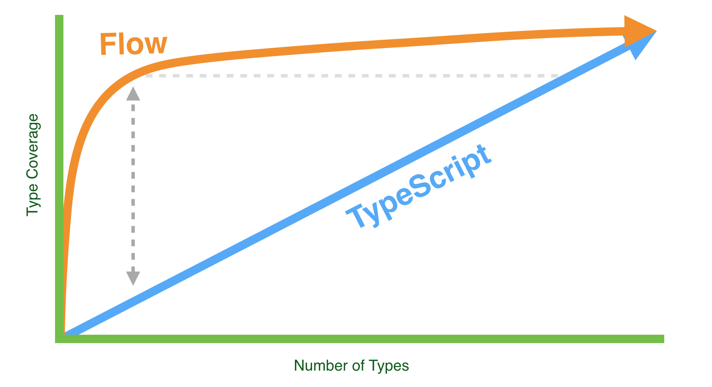

由于最近开发rn第一个大型项目——矿且，随着代码量的增加，关于类型检查的需求就随之而来，要不停使用jsdocs和写文档总结很麻烦。

js中的类型检查的手段有以下，Flow和tsx都是可选项。

- Flow: `// @flow` 向文件顶部添加注释

- TypeScript：将扩展名更改为`.js`扩展`.ts` 名

- React自带的propType设置,虽然使用自带的，简单粗暴且支持最好，但功能少且臃肿

  

# Flow


# PropType

一、 prop-types类型的检测

（1）安装及引入

```react
//安装
npm install prop-types --save
//引入
import PropTypes from 'prop-types';
```

（2）使用

```react
import {Text} from 'react-native';

class DatePicker extends React.Component {
  render() {
    return (
      <Text>测试属性检测，{this.props.age}</Text>
    );
  }
}

DatePicker.defaultProps = {
  age: 0, // 默认值
};

DatePicker.propTypes = {
  age: PropTypes.number, // 这边年龄只允许接收数字类型
};
```

(3)ES7中使用方法示例

```react
class DatePicker extends React.Component {
  //如果没有传递该属性时的默认值
  static defaultProps = {
    age: 17
  }
  //如果传递该属性，该属性值必须为字符串
  static propTypes = {
    age: PropTypes.number
  }
  render() {
    return (
      <div>测试类型检测, {this.props.age}</div>
	   )
  }
}
```


(4)使用isRequired设置属性为必须传递的值

```react
static propTypes={
    name:PropTypes.string.isRequired
}
```

